# DevSecOps CI/CD Pipeline for Expense Tracker Application

## Project Overview

This project demonstrates an end-to-end DevSecOps CI/CD pipeline for a Java Spring Boot Expense Tracker application.

The pipeline automatically performs source code checkout, application build, dependency security scanning, code quality analysis, Docker image creation, container image vulnerability scanning, Docker Hub publishing, application deployment, health checks, and deployment verification.

The application uses Spring Boot and MySQL and is deployed using Docker Compose.

---

## DevSecOps Pipeline Flow

GitHub → Jenkins → Maven Build → OWASP Dependency Check → SonarQube Analysis → Quality Gate → Docker Build → Trivy Image Scan → Docker Hub → Docker Compose Deployment → Health Check → Verification

---

## Tools and Technologies

| Category | Tools |
|---|---|
| Source Code Management | Git and GitHub |
| CI/CD | Jenkins |
| Build Tool | Maven |
| Programming Language | Java 17 |
| Framework | Spring Boot |
| Database | MySQL 8 |
| Code Quality | SonarQube |
| Dependency Security | OWASP Dependency-Check |
| Containerization | Docker |
| Container Orchestration | Docker Compose |
| Container Security | Trivy |
| Container Registry | Docker Hub |
| Cloud Platform | AWS EC2 |
| Operating System | Linux |

---

## Pipeline Stages

### 1. Checkout SCM

Jenkins pulls the latest application source code from the GitHub repository.

### 2. Build

Maven compiles the Java application and generates the Spring Boot JAR file.

### 3. OWASP Dependency Check

OWASP Dependency-Check scans application dependencies for known vulnerabilities and CVEs.

### 4. SonarQube Analysis

SonarQube analyzes the source code for:

- Bugs
- Code smells
- Security vulnerabilities
- Security hotspots
- Code quality issues

### 5. Quality Gate

The Jenkins pipeline checks the SonarQube Quality Gate result before continuing.

### 6. Docker Build

A Docker image is created using a multi-stage Dockerfile.

### 7. Trivy Image Scan

Trivy scans the Docker image for HIGH and CRITICAL vulnerabilities.

The scan is configured to generate vulnerability results without stopping the pipeline.

### 8. Push Image to Docker Hub

The Docker image is tagged and pushed to Docker Hub.

Docker Hub image:

`rakeshsharma620/expense-tracker:latest`

### 9. Deploy

The old application containers are removed and new application and MySQL containers are started using Docker Compose.

### 10. Health Check

Jenkins checks the application endpoint using curl and waits until the application becomes available.

### 11. Verify

Docker Compose verifies that:

- The Spring Boot application container is running
- The MySQL container is healthy
- The application port is available

---

## Architecture Diagram

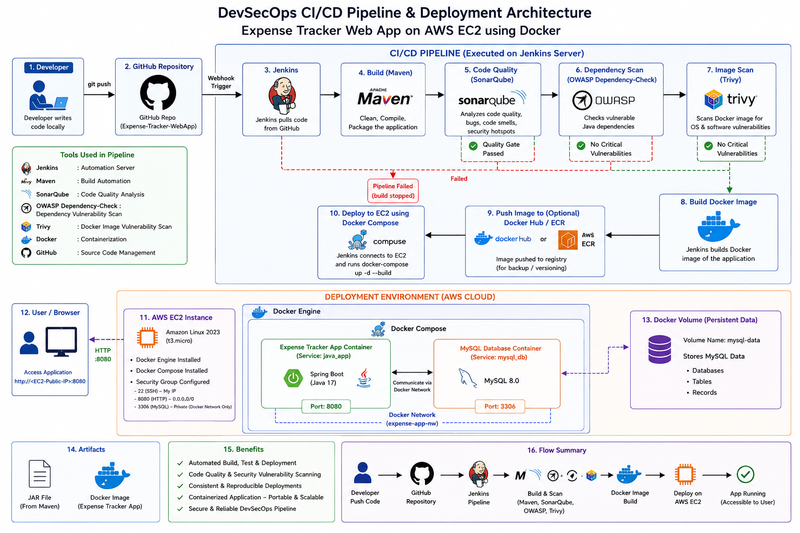

---

## Jenkins Pipeline Success

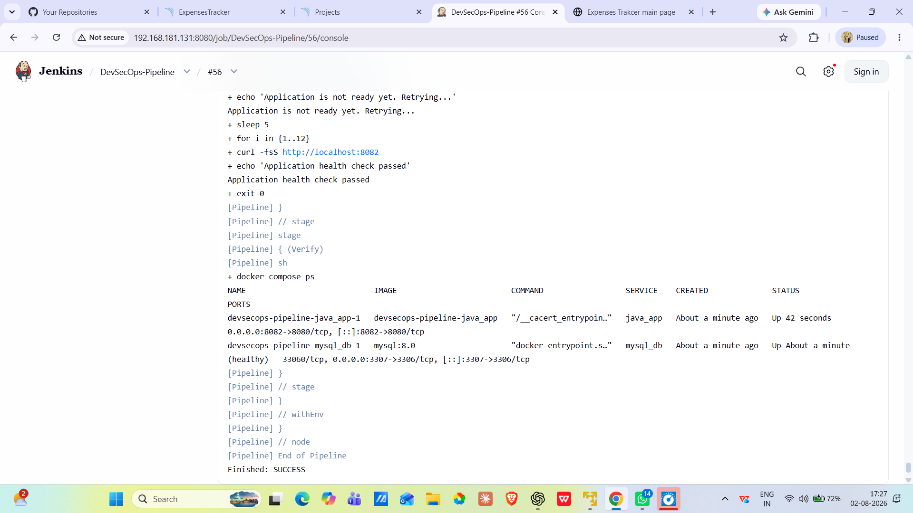

---

## Jenkins Pipeline Stages

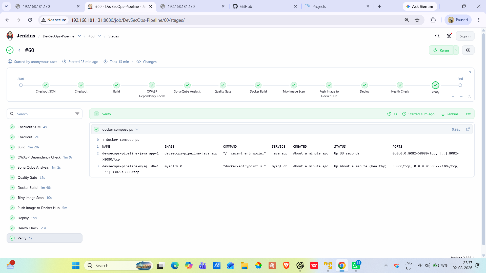

---

## SonarQube Dashboard

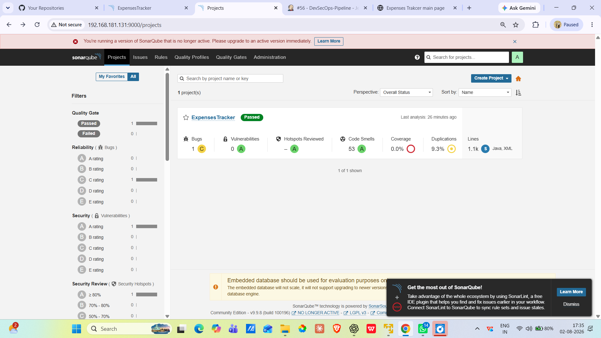

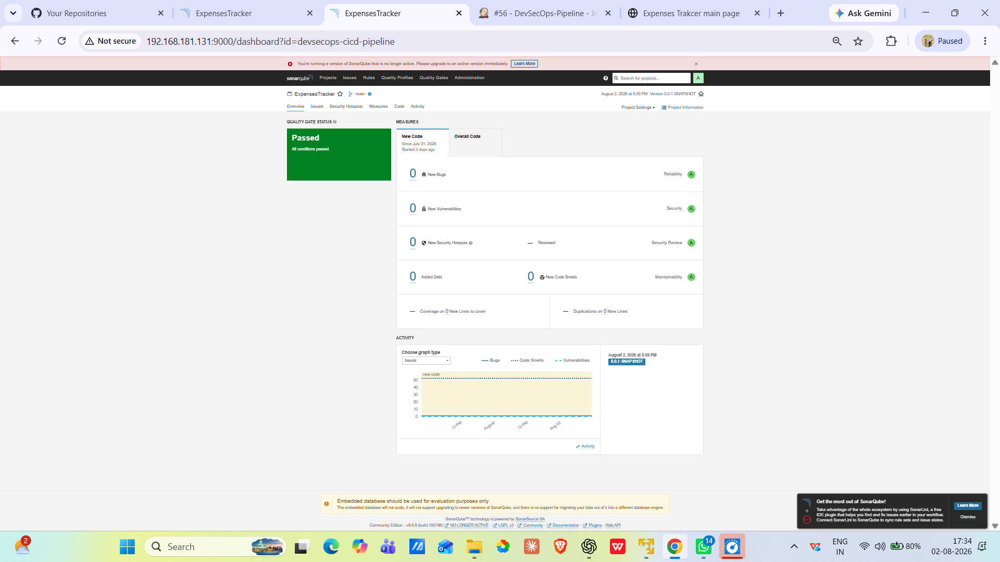

---

## OWASP Dependency Check

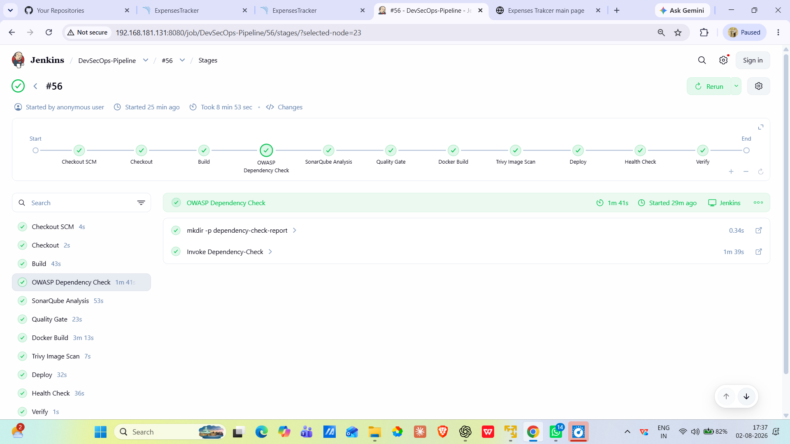

---

## Trivy Image Security Scan

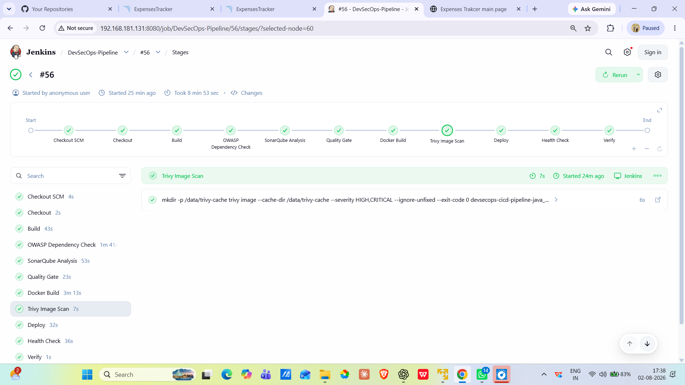

---

## Docker Containers

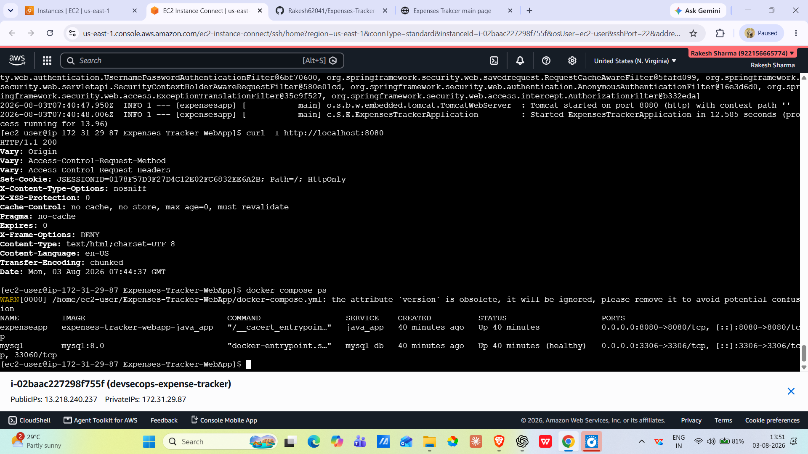

---

## Application Running

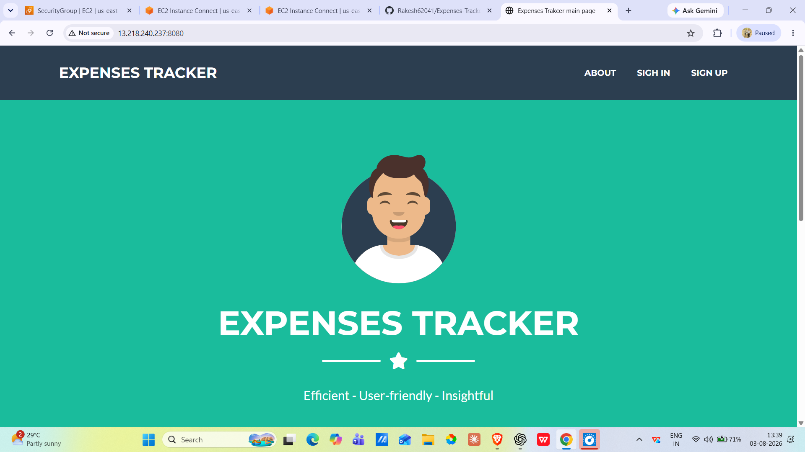

---

## GitHub Repository

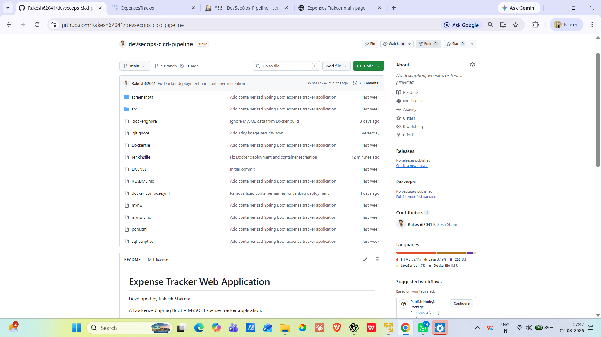

---

## AWS EC2 Deployment

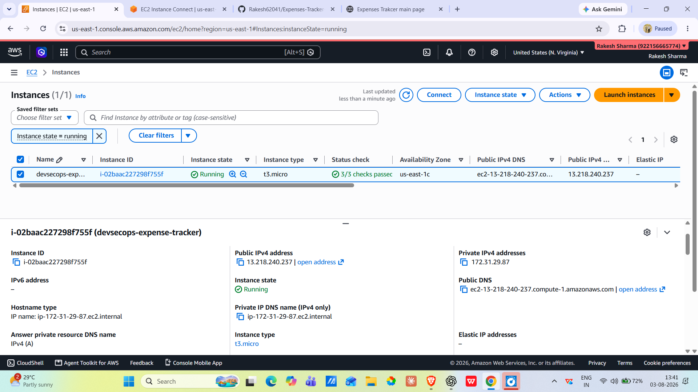

---

## AWS Security Group

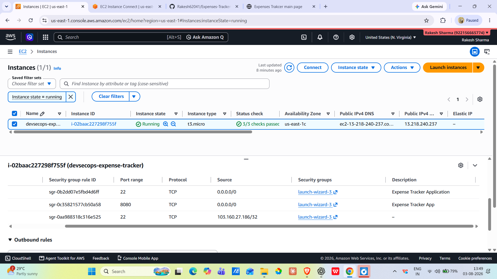

---

## Application Deployment

The application is deployed on AWS EC2 using Docker Compose.

Application port:

```text
8082
